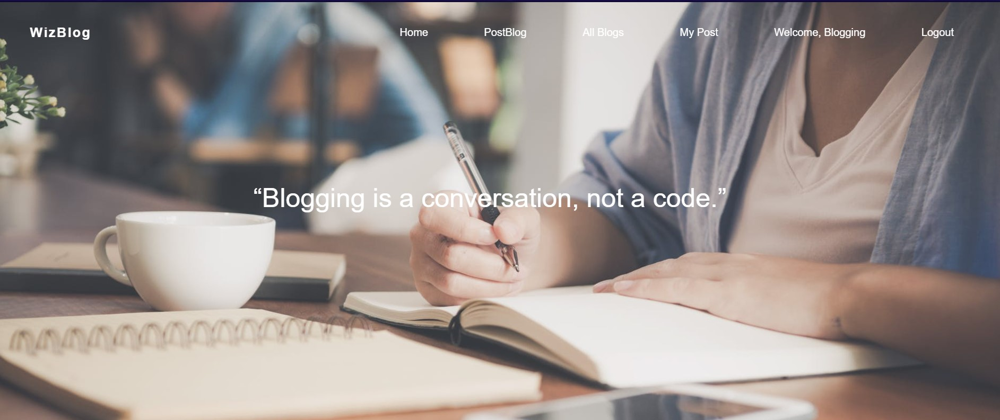

# WizBlog

WizBlog is developed in Django-Python Web App Framework using Atom.
For Database Management SQLite3 has been used.

# Table Of Content
- [Introduction](#introduction)
- [Requirements](#requirements)
- [Features](#features)
- [Installation](#installation)
- [Setup](#setup)
- [Contribution](#contribution)

## Introduction
This website is platform independent, on which user can create their own account to upload blogs , on this platform multiple users can see their uploaded blogs with publicly adding comment feature.

For Database management **SQLite3** is used.

## Requirements
- python - version 3.7.4 or above
- SQLite - version 3
- GUI - HTML 5, CSS 3, Bootstrap 3.7.1, Javascript   

## Features
1. Login and Sign up for users with complete validations.
2. User can post their own blogs which they can update and delete.
3. All user can see their uploaded blogs on All Blogs page.
4. User can also add comments publicly.

## Installation

python 3.7
- Sign up using valid credential
- Login with username and password

## Setup
1. Install django by typing the following command in command prompt-
      python -m pip install Django

2. Download My-Projects-master.zip, unzip the file.
3. Add app name in settings.py

    INSTALLED_APPS = [
    '..................',

    'django.contrib.sessions',

    'django.contrib.messages',

    'django.contrib.staticfiles',

    'blog',
     ]

4. Run command py manage.py makemigrations, Then py manage.py migrate.

5. Now to access admin panel run command py manage.py createsuperuser,
            then enter your username,email and password.

6. Run server- py manage.py runserver,
      Admin panel at http://127.0.0.1:8000/admin/

7. To access site locally- http://127.0.0.1:8000

## Contribution
Project was created by [Divyansh Shrivastava](mailto:contactshrivastava@gmail.com).
 
